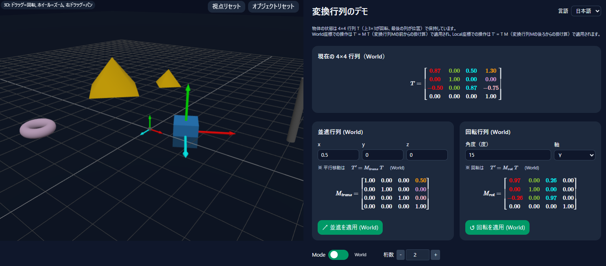
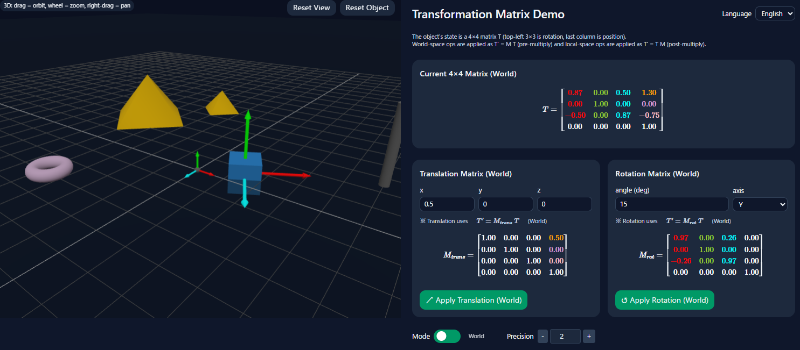

#### [English](#english) | [日本語](#日本語)
### 日本語
# 変換行列のデモ
### 概要



この「変換行列のデモ」は **React + three.js + MathJax** を用いた Web アプリです。3D 空間に配置したオブジェクト(青い箱)の **4×4 変換行列 (位置と向き)** を可視化し、ワールド座標系／ローカル座標系での平行移動・回転を体験的に理解することができます。

- **3D 描画**: three.js + OrbitControls
- **数式表示**: better-react-mathjax (MathJax v3)
- **変換操作**:
  - ワールド座標系 (前から掛け算, pre-multiply)
  - ローカル座標系 (後ろから掛け算, post-multiply)
- **UI**: モード切替トグル (ワールド／ローカル)、桁数調整

### 🚀 機能
- 3D 空間に物体と基準オブジェクト（地面・柱・トーラス等）を表示
- オブジェクトの 4×4 行列を MathJax で可視化
- 平行移動や回転行列を入力し、ワールド／ローカル基準で適用
- 視点リセット、オブジェクトリセットボタン

### デモ

[プログラムの使用例(Webアプリ)](https://tanaken-basis.github.io/transformation-matrix-demo/) で実際の挙動を確かめることができますのでご覧ください。

## 🛠️ インストールと実行方法

### インストールの前に
ローカルマシンでのインストールと実行には、[Node.js](https://nodejs.org/)が必要です。

### インストール
まず、リポジトリをローカルマシンにクローンします。
ターミナルで以下のように実行するか、または、[ここ](https://github.com/tanaken-basis/transformation-matrix-demo)からzipファイルをダウンロードして展開します。
```sh
git clone https://github.com/tanaken-basis/transformation-matrix-demo.git
```

次に、プロジェクトのディレクトリに移動します。
```sh
cd transformation-matrix-demo
```

ライブラリのインストールをします。
```sh
npm install
```
### 実行方法

ターミナルで以下のように入力して、ブラウザで [http://localhost:5173](http://localhost:5173) （ポート番号は5173とは違う場合もあります）にアクセスするとWebアプリが起動します。
```sh
npm start
```

---
#### [English](#english) | [日本語](#日本語)
### English
# Transformation Matrix Demo
### Overview



This project is a **React + three.js + MathJax** web application. It visualizes an object's **4×4 transformation matrix (position + orientation)** in 3D space and demonstrates how translations and rotations apply in **world space** vs **local space**.

- **3D Rendering**: three.js + OrbitControls
- **Math Display**: better-react-mathjax (MathJax v3)
- **Transform Operations**:
  - World-space (pre-multiply)
  - Local-space (post-multiply)
- **UI**: Mode switch toggle (World/Local) & precision control

### Features

- Render an object with reference objects (ground, pillar, torus, etc.)
- Show the object's 4×4 matrix using MathJax
- Apply translation and rotation matrices in world/local mode
- Reset view and reset object buttons

### Demo

Check out the [example of program usage](https://tanaken-basis.github.io/transformation-matrix-demo/) to see how it works.

## 🛠️ Installation and Execution

### Prerequisites
Before installing and running the program on your local machine, make sure you have [Node.js](https://nodejs.org/) installed.

### Installation
First, clone the repository to your local machine. You can do this by running the following command in your terminal or by downloading the zip file from [here](https://github.com/tanaken-basis/transformation-matrix-demo):
```sh
git clone https://github.com/tanaken-basis/transformation-matrix-demo.git
```

Navigate to the project directory:
```sh
cd transformation-matrix-demo
```

Install the required libraries:
```sh
npm install
```

### Execution
To run the program, enter the following command in your terminal. Access the web app by opening your browser and navigating to http://localhost:5173/ (note that the port number may differ):
```sh
npm start
```
